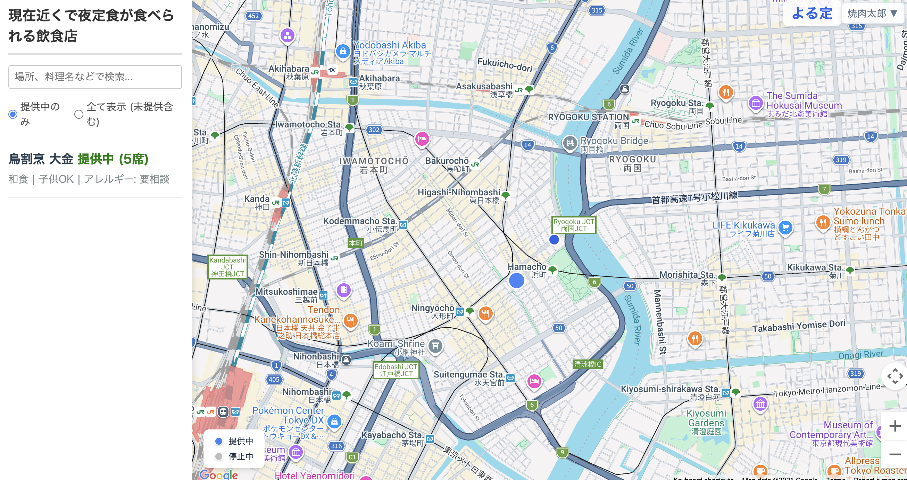

# Yorutei (よる定)

深夜の定食マッチングプラットフォーム。飲食店とお客様をリアルタイムでつなぎ、遅い時間帯でもお手頃な定食を見つけられるサービスです。
  

## 概要

Yorutei は、飲食店が「今夜の定食」の提供状況をリアルタイムで発信し、お客様が地図上で近くの営業中店舗を発見・予約できる Web アプリケーションです。

### 主な機能

**お客様向け**
- 地図上で営業中の店舗をリアルタイムに確認
- 残り食数・ジャンル・距離による店舗検索
- ワンタップ予約（15 分間の取り置き）
- 徒歩ルート案内付きナビゲーション
- 食事タイマー（20 分）による食事体験管理

**店舗向け**
- 営業ステータスのオン/オフ切替
- 残り食数のリアルタイム管理
- 店舗情報（ジャンル、子連れ対応、アレルギー対応等）の登録・編集
- 住所からの自動ジオコーディング


### お試し利用

**テスト用お客様アカウント**
- ID:test2@gmail.com
- password: testpw

**店舗用お客様アカウント**
- ID:test1@gmail.com
- password: testpw

## 技術スタック

| カテゴリ | 技術 |
|---------|------|
| フレームワーク | React 18 + TypeScript |
| ビルドツール | Vite 6 |
| 状態管理 | Zustand / TanStack React Query |
| 認証・DB | Firebase Authentication / Realtime Database |
| 地図 | Google Maps JavaScript API / Geocoding API |
| ルーティング | React Router v7 |

## プロジェクト構成

```
src/
├── components/        # UI コンポーネント
│   ├── map/           #   地図・サイドバー・予約モーダル
│   └── admin/         #   店舗管理用コントロール
├── routes/            # ページコンポーネント
│   ├── user/          #   お客様向けページ
│   └── store/         #   店舗向けページ
├── stores/            # Zustand ストア（状態管理）
├── hooks/             # カスタムフック
├── services/          # Firebase・API クライアント
├── config/            # 環境設定・API 設定
├── types/             # TypeScript 型定義
├── App.tsx            # ルーター設定
└── main.tsx           # エントリーポイント
```

## セットアップ

### 前提条件

- Node.js (v18 以上推奨)
- npm
- Firebase プロジェクト
- Google Maps API キー

### インストール

```bash
npm install
```

### 環境変数の設定

`.env.example` を `.env.local` にコピーし、各値を設定してください。

```bash
cp .env.example .env.local
```

必要な環境変数:

| 変数名 | 説明 |
|--------|------|
| `VITE_FIREBASE_API_KEY` | Firebase API キー |
| `VITE_FIREBASE_AUTH_DOMAIN` | Firebase Auth ドメイン |
| `VITE_FIREBASE_DATABASE_URL` | Firebase Realtime Database URL |
| `VITE_FIREBASE_PROJECT_ID` | Firebase プロジェクト ID |
| `VITE_FIREBASE_STORAGE_BUCKET` | Firebase Storage バケット |
| `VITE_FIREBASE_MESSAGING_SENDER_ID` | Firebase Messaging Sender ID |
| `VITE_FIREBASE_APP_ID` | Firebase App ID |
| `VITE_GOOGLE_MAPS_API_KEY` | Google Maps API キー |
| `VITE_API_BASE_URL` | バックエンド API の URL（任意） |

### 開発サーバーの起動

```bash
npm run dev
```

http://localhost:5173 でアプリが起動します。

### その他のコマンド

```bash
npm run build      # プロダクションビルド
npm run preview    # ビルド結果のプレビュー
npm run lint       # ESLint によるコード検査
```

## 画面フロー

```
ロール選択 (/)
├── お客様
│   ├── ログイン (/user/login)
│   ├── 新規登録 (/user/register)
│   └── マップ (/map)
│       ├── 店舗一覧閲覧
│       ├── 予約 → ナビゲーション
│       ├── 写真撮影
│       └── 食事タイマー
└── 店舗
    ├── ログイン (/store/login)
    ├── 新規登録 (/store/register)
    ├── マイページ (/store/mypage)
    ├── ステータス管理 (/store/status)
    └── 店舗情報編集 (/store/edit)
```

## データモデル

### Firebase Realtime Database

```
/stores/{storeId}
  ├── isOpen: boolean          # 営業中フラグ
  ├── remainingCount: number   # 残り食数
  ├── lastUpdated: timestamp
  ├── location: { lat, lng }
  └── [店舗マスタ情報]

/users/{uid}
  ├── role: 'user' | 'store'
  ├── email, nickname
  ├── activeReservationId
  └── overtimeCount

/reservations/{reservationId}
  ├── storeId, userId
  ├── status: 'active' | 'completed' | 'cancelled' | 'expired'
  ├── createdAt, expiresAt    # 予約有効期間: 15分
  └── quantity
```

## ライセンス

Private
